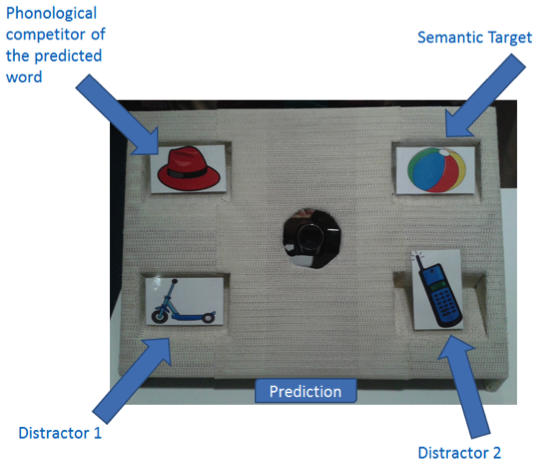

```{r, echo=FALSE, include=FALSE}

library(doBy)
library(reshape2)
library(plyr)
library(car)
require(gdata)
require(ggplot2)
require(longitudinalData)
library(doBy)
ET_Import.NoExpand = function(path_name,Timing,PlaceCodes){
list.files(path = path_name,full.names = T, pattern = ".xlsx") -> file_list

ET = c()
for (x in file_list){
  print(x)
	FullSubj = proc_subj.NoExpand(x,Timing,PlaceCodes)
	ET = rbind(ET,FullSubj)
	print(x)
	}
	return(ET)
}

# Functions for basic data analysis.
# Function to tell you whether participants looked to Instrument on each trial
# The last SummaryBy statement can be modified to look at only the first X gazes, currently set at 4 to capture the first 3 eye movements (1 is starting point), currently 
LooksToInst = function(data){
  require(plyr)
  data = ddply(data,~Name.+Trial,transform,NextCode = c(Code[2:(length(Code))],Code[length(Code)]))
  data$SwitInst = 0
  data[data$NextCode %in% c("TI"),]$SwitInst = 1
  data = ddply(data,~Name.+Trial,transform,LookEnd = c(TimeFrame[2:(length(TimeFrame))],TimeFrame[length(TimeFrame)]))
  data$LookTime = data$LookEnd - data$TimeFrame
  if ("RC" %in% colnames(data)){
    data.Look <- summaryBy(Inst+SwitInst~Age+QCond+Cond+Pop+Name.+ItemNo+ExOrd, data = data[ data$LookTime > 0,], FUN = sum) # This and the above 3 lines ensure that we don't count any 1-frame-long looks, eg the last line of each trial in the datafile. 
  }
  else data.Look <- summaryBy(Inst+SwitInst~Age+QCond+Cond+Name.+ItemNo, data = data[ data$LookTime > 0,], FUN = sum) # This and the above 3 lines ensure that we don't count any 1-frame-long looks, eg the last line of each trial in the datafile. 
  data.Look$Inst = 0
  data.Look[data.Look$Inst.sum > 0,]$Inst = 1
  return(data.Look)
}


#######


proc_subj.NoExpand = function(filename,Timing,PlaceCodes){
  require(gdata)
  subj = read.xls(filename, sheet=2)
  subj <- subj[!grepl("set",subj$Marker.Name, ignore.case = TRUE),]
  #subj <- subj[subj$Marker.Name %in% c("BL","CN","LL","LR","OT","UL","UR"),]
  
  subj = merge(subj,PlaceCodes, by = "Trial", sort = FALSE)
  subj = merge(subj,Timing, by = "Trial",sort = FALSE)
  
  
  
  subj$Marker.Name = as.character(subj$Marker.Name)
  subj$Marker.Name = gsub(" ","",subj$Marker.Name)
  subj$Code = NA
  subj$Code = subj$Marker.Name
  
  for (i in unique(PlaceCodes$Trial)){
    if (length(subj[subj$Trial == i & subj$Marker.Name == "UL",]$Code) > 0){subj[subj$Trial == i & subj$Marker.Name == "UL",]$Code = as.character(PlaceCodes[PlaceCodes$Trial == i ,]$UL)}
    if (length(subj[subj$Trial == i & subj$Marker.Name == "UR",]$Code) > 0){subj[subj$Trial == i & subj$Marker.Name == "UR",]$Code = as.character(PlaceCodes[PlaceCodes$Trial == i ,]$UR)}
    if (length(subj[subj$Trial == i & subj$Marker.Name == "LL",]$Code) > 0){subj[subj$Trial == i & subj$Marker.Name == "LL",]$Code = as.character(PlaceCodes[PlaceCodes$Trial == i ,]$LL)}
    if (length(subj[subj$Trial == i & subj$Marker.Name == "LR",]$Code) > 0){subj[subj$Trial == i & subj$Marker.Name == "LR",]$Code = as.character(PlaceCodes[PlaceCodes$Trial == i ,]$LR)}
  }
  
  subj$NounFrame = round((subj$N.ONSET - subj$V.ONSET)*30)
  subj$OffsetFrame = round((subj$OFFSET - subj$V.ONSET)*30)
  
  subj$Hour = read.table(textConnection(as.character(subj$Start)), sep = ":")[,1]
  subj$Min = read.table(textConnection(as.character(subj$Start)), sep = ":")[,2]
  subj$Sec = read.table(textConnection(as.character(subj$Start)), sep = ":")[,3]
  subj$Frame = read.table(textConnection(as.character(subj$Start)), sep = ":")[,4]
  subj$FullTimeFrame = subj$Frame+(subj$Sec*30)+(subj$Min*1798)+(subj$Hour*107892)
  subj$TimeFrame = NA
  for (i in unique(subj$Trial)){
    
    subj[subj$Trial == i,]$TimeFrame = subj[subj$Trial == i,]$FullTimeFrame - min(subj[subj$Trial == i,]$FullTimeFrame)
  }  
  
  
  
  subj -> FullSubj
  
  FullSubj$PT = 0
  if (length(FullSubj[FullSubj$Code == "PT",]$PT>0)){FullSubj[FullSubj$Code == "PT",]$PT = 1}
  
  FullSubj$ST = 0
  if (length(FullSubj[FullSubj$Code == "ST",]$ST>0)){FullSubj[FullSubj$Code == "ST",]$ST =  1}
  
  FullSubj$D1 = 0
  if (length(FullSubj[FullSubj$Code == "D1",]$D1>0)){FullSubj[FullSubj$Code == "D1",]$D1 = 1}
  
  FullSubj$D2 = 0
  if (length(FullSubj[FullSubj$Code == "D2",]$D2 > 0)){FullSubj[FullSubj$Code == "D2",]$D2 = 1}
  
  
  FullSubj$Cond <- "Phon"
  FullSubj[grep("SEM",FullSubj$Trial),]$Cond <- "Sem"
  FullSubj$Cond <- as.factor(FullSubj$Cond)
  
  FullSubj$Type <- ifelse(length(grep("B",FullSubj$Trial)) > 0, "B","A")
  FullSubj$Type <- as.factor(FullSubj$Type)
  
  FullSubj$Marker.Name = as.factor(FullSubj$Marker.Name)
  FullSubj$Code = as.factor(FullSubj$Code)
  # 
  # FullSubj$TimeWindow <- "Predict"
  # FullSubj[FullSubj$TimeFrame > FullSubj$NounFrame,]$TimeWindow <- "Recog"
  # FullSubj$TimeWindow <- as.factor(FullSubj$TimeWindow)
  
  return(FullSubj)
}


#######


```
##Design
This document describes the initial results from the phonological prediction study carried out by Cara Connachan and Ellen Carracher.

In the study, children hear pairs of high-cloze sentences while looking at and interacting with a stage containing four pictures. Each set of four pictures is associated with one of two pairs of sentences (an A version and a B version) which allow us to analyze gaze while controlling for basic salience and interest of the visual stimuli.

For each pair of sentences, the final word of one sentence is depicted on the stage. Looks to this picture before it is named provide us with an index of overall prediction.
The final word of the other sentence is not depicted. Instead, a phonological competitor is predicted. Looks to this picture provide us with an index of phonological prediction [we expect].



>>A. “Teddy goes outside with his friends and throws his cool new ball. Afterwards, Teddy goes inside   to eat his dinner, but before he can eat he must wash his muddy hands (hat). Can you make Teddy throw the ball?”

>>B. “Teddy wants to call his friend so he dials the big phone. He tells his friend that every morning he does his homework before he goes to school (scooter). Can you make Teddy dial the phone?”


## Methods
```{r, echo=FALSE, include=FALSE}
# Phon Prediction Processing scripts
Timing <- read.csv("./EyeGaze/Timing.csv",header = T)
PlaceCodes <- read.csv("./EyeGaze/PlaceCodes.csv",header =  T)
Demog <- read.csv("./EyeGaze/PhPrDemographics.csv", header = T)
PhPr <- ET_Import.NoExpand("./EyeGaze/SubjData/",Timing,PlaceCodes)
Demog$Age <- (Demog$Age - mean(Demog$Age, na.rm = T))/2*sd(Demog$Age, na.rm = T)
Demog$BPVS.raw <- (Demog$BPVS.raw - mean(Demog$BPVS.raw, na.rm = T))/2*sd(Demog$BPVS.raw, na.rm = T)
Demog$BPVS.stan <- (Demog$BPVS.stan - mean(Demog$BPVS.stan, na.rm = T))/2*sd(Demog$BPVS.stan, na.rm = T)


ddply(PhPr, .(Name.,Trial,Cond,Type,V.ONSET,N.ONSET,OFFSET,NounFrame,OffsetFrame), summarize, TimeFrame = c(0:max(TimeFrame))) -> PhPr.Expand
PhPr.Expand <- merge(PhPr,PhPr.Expand, by = c("Name.","Trial","Cond","Type","V.ONSET","N.ONSET","OFFSET","NounFrame","OffsetFrame","TimeFrame"), all= TRUE)
PhPr.Expand$PT <- t(imputation(matrix(PhPr.Expand$PT, nrow = 1),method = "locf"))
PhPr.Expand$ST <- t(imputation(matrix(PhPr.Expand$ST, nrow = 1),method = "locf"))
PhPr.Expand$D1 <- t(imputation(matrix(PhPr.Expand$D1, nrow = 1),method = "locf"))
PhPr.Expand$D2 <- t(imputation(matrix(PhPr.Expand$D2, nrow = 1),method = "locf"))

PhPr.Expand <- ddply(PhPr.Expand, .(Name.,Trial), transform, TimeFrame = TimeFrame - NounFrame) 

PhPr.Expand <- ddply(PhPr.Expand, .(Name.,Trial), transform, TimeWindow = ifelse(TimeFrame >= 0,"Recog","Predict")) 
PhPr.Expand <- ddply(PhPr.Expand, .(Name.,Trial,TimeWindow), transform, Time = TimeFrame*33.3333 )

PhPr.Expand <- merge(PhPr.Expand, Demog) 

# Test we have 16 trials for each subject
PhPr.Expand$Test <- 1
summaryBy(Test~Name. + Trial, data = PhPr.Expand) -> a
summaryBy(Test.mean~Name. , data = a, FUN = c(length)) -> a
a[a$Test.mean.length <16,]

save(list = "PhPr.Expand", file = "PhPr_Expand_Child.RDATA")

Demog2 <- read.csv("./EyeGaze/PhPrDemographics.csv", header = T)
```

We tested `r length(unique(Demog2$SubjNo))` children whose mean age was `r mean(Demog2$Age)` months.

We coded eye movements from the predictive verb to 1000ms after the onset of the predicted noun, although our intended analysis focused on a time window from 200ms before the predicted noun to 100ms after.

We can look at gaze to the four pictures, and then also ratio of gaze to the two possible semantic or phonological targets.

```{r echo = FALSE, include=FALSE}

SumFun <- function(x){sum(x)*(1000/30)}

print("By Subject means, 200ms before and 100 after noun, looking within a trial")
PhPr.Sum <- summaryBy(PT+ST+D1+D2 ~ Name. + Trial + Cond + Age + BPVS.raw + BPVS.stan, data = PhPr.Expand[PhPr.Expand$Time >= -200 & PhPr.Expand$Time <= 100 ,],keep.names = T, FUN = c(SumFun))
PhPr.Sum$Count <- 1
summaryBy(Count ~ Name., data = PhPr.Sum, FUN = c(length)) -> a
# How many missing trials
a[a$Count.length <16,]

PhPr.BySubj <- summaryBy(PT+ST+D1+D2 ~ Name. + Cond + Age + BPVS.raw + BPVS.stan, data = PhPr.Sum, keep.names = T) 
PhPr.BySubj$SRatio <- PhPr.BySubj$ST/(PhPr.BySubj$ST + PhPr.BySubj$D1)
PhPr.BySubj$PRatio <- PhPr.BySubj$PT/(PhPr.BySubj$PT + PhPr.BySubj$D2)
summaryBy(PT+ST+D1+D2 ~ Cond, data = PhPr.Sum, keep.names = T)

PhPr.Sum1 <- PhPr.Sum

PhPr.Sum1$PT <- ifelse(PhPr.Sum1$PT > 0 ,1, 0)
PhPr.Sum1$ST <- ifelse(PhPr.Sum1$ST > 0 ,1, 0)
PhPr.Sum1$D1 <- ifelse(PhPr.Sum1$D1 > 0 ,1, 0)
PhPr.Sum1$D2 <- ifelse(PhPr.Sum1$D2 > 0 ,1, 0)
PhPr.BySubj1 <- summaryBy(PT+ST+D1+D2 ~ Name. + Cond + Age + BPVS.raw + BPVS.stan, data = PhPr.Sum1, keep.names = T) 

PhPr.BySubj1$SRatio <- PhPr.BySubj1$ST/(PhPr.BySubj1$ST + PhPr.BySubj1$D1)
PhPr.BySubj1$PRatio <- PhPr.BySubj1$PT/(PhPr.BySubj1$PT + PhPr.BySubj1$D2)
```

```{r echo = FALSE}
summaryBy(PT+ST+D1+D2 +SRatio  + PRatio~ Cond, data = PhPr.BySubj1, keep.names = T, na.rm = T)
```

As can be seen, there is a strong tendency to gaze to the Semantic Target, but no tendency to look to the Phonological Target.

This can also be seen in the pattern of eye movements over time [aligned by the start of the predicted word].

```{r echo = FALSE, message = FALSE}

se <- function(x){
  x <- sd(x)/sqrt(36)
	return(x)
	}

PhPr.Graph <- summaryBy(PT+ST+D1+D2~Time+Cond+Name.+Trial, data = PhPr.Expand[PhPr.Expand$Time <= 1000 & PhPr.Expand$Time >= -1500  ,], FUN = c(mean),keep.names = T)
PhPr.Graph <- summaryBy(PT+ST+D1+D2~Time+Cond+Name., data = PhPr.Graph, FUN = c(mean),keep.names = T,na.rm = T)
PhPr.Graph <- summaryBy(PT+ST+D1+D2~Time+Cond, data = PhPr.Graph, FUN = c(mean,se))


PhPr.Graph2 <- melt(PhPr.Graph,
        # ID variables - all the variables to keep but not split apart on
    id.vars=c("Time","Cond"),
        # The source columns
    measure.vars=c("PT.mean","ST.mean", "D1.mean", "D2.mean" ),
        # Name of the destination column that will identify the original
        # column that the measurement came from
    value.name="Prop",
    variable.name ="Quadrant"
    )

#QUD.Graph2$Quadrant <- revalue(QUD.Graph2$Quadrant, c("Inst.mean"="Target Instrument", "TA.mean"="Target Animal", "DA.mean" = "Distractor Animal","DI.mean" = "Distractor Instrument"))    
#QUD.Graph2$Quadrant <- ordered(QUD.Graph2$Quadrant, levels = c("Target Animal", "Distractor Animal", "Target Instrument", "Distractor Instrument"))
ggplot(PhPr.Graph2,aes(Time,Prop,linetype = Quadrant)) + facet_wrap(~Cond, nrow = 2) + stat_summary(fun.y = mean, geom = "line", size = 1) + theme(legend.title=element_blank(),legend.position="bottom")+ theme(legend.title=element_blank(),legend.position="bottom")+scale_linetype_manual(values=c(1,2,3,4))+labs(x = "Time (ms)",y = "Proportion of Looks")

```


The same is true if we look at eye movements aligned by the start of the predictive verb

```{r include = FALSE}

Timing <- read.csv("./EyeGaze/Timing.csv",header = T)
PlaceCodes <- read.csv("./EyeGaze/PlaceCodes.csv",header =  T)
Demog <- read.csv("./EyeGaze/PhPrDemographics.csv", header = T)
PhPr <- ET_Import.NoExpand("./EyeGaze/SubjData/",Timing,PlaceCodes)
Demog$Age <- (Demog$Age - mean(Demog$Age, na.rm = T))/2*sd(Demog$Age, na.rm = T)
Demog$BPVS.raw <- (Demog$BPVS.raw - mean(Demog$BPVS.raw, na.rm = T))/2*sd(Demog$BPVS.raw, na.rm = T)
Demog$BPVS.stan <- (Demog$BPVS.stan - mean(Demog$BPVS.stan, na.rm = T))/2*sd(Demog$BPVS.stan, na.rm = T)


ddply(PhPr, .(Name.,Trial,Cond,Type,V.ONSET,N.ONSET,OFFSET,NounFrame,OffsetFrame), summarize, TimeFrame = c(0:max(TimeFrame))) -> PhPr.Expand
PhPr.Expand <- merge(PhPr,PhPr.Expand, by = c("Name.","Trial","Cond","Type","V.ONSET","N.ONSET","OFFSET","NounFrame","OffsetFrame","TimeFrame"), all= TRUE)
PhPr.Expand$PT <- t(imputation(matrix(PhPr.Expand$PT, nrow = 1),method = "locf"))
PhPr.Expand$ST <- t(imputation(matrix(PhPr.Expand$ST, nrow = 1),method = "locf"))
PhPr.Expand$D1 <- t(imputation(matrix(PhPr.Expand$D1, nrow = 1),method = "locf"))
PhPr.Expand$D2 <- t(imputation(matrix(PhPr.Expand$D2, nrow = 1),method = "locf"))

#PhPr.Expand <- ddply(PhPr.Expand, .(Name.,Trial), transform, TimeFrame = TimeFrame - NounFrame) 

PhPr.Expand <- ddply(PhPr.Expand, .(Name.,Trial), transform, TimeWindow = ifelse(TimeFrame >= NounFrame,"Recog","Predict")) 
PhPr.Expand <- ddply(PhPr.Expand, .(Name.,Trial,TimeWindow), transform, Time = TimeFrame*33.3333 )

PhPr.Expand <- merge(PhPr.Expand, Demog) 

# Test we have 16 trials for each subject
PhPr.Expand$Test <- 1
summaryBy(Test~Name. + Trial, data = PhPr.Expand) -> a
summaryBy(Test.mean~Name. , data = a, FUN = c(length)) -> a
a[a$Test.mean.length <16,]

save(list = "PhPr.Expand", file = "PhPr_Expand_Child.RDATA")

Demog2 <- read.csv("./EyeGaze/PhPrDemographics.csv", header = T)

SumFun <- function(x){sum(x)*(1000/30)}

print("By Subject means, 200ms before and 100 after noun, looking within a trial")
PhPr.Sum <- summaryBy(PT+ST+D1+D2 ~ Name. + Trial + Cond + Age + BPVS.raw + BPVS.stan, data = PhPr.Expand[PhPr.Expand$Time >= -200 & PhPr.Expand$Time <= 100 ,],keep.names = T, FUN = c(SumFun))
PhPr.Sum$Count <- 1
summaryBy(Count ~ Name., data = PhPr.Sum, FUN = c(length)) -> a
# How many missing trials
a[a$Count.length <16,]

PhPr.BySubj <- summaryBy(PT+ST+D1+D2 ~ Name. + Cond + Age + BPVS.raw + BPVS.stan, data = PhPr.Sum, keep.names = T) 
PhPr.BySubj$SRatio <- PhPr.BySubj$ST/(PhPr.BySubj$ST + PhPr.BySubj$D1)
PhPr.BySubj$PRatio <- PhPr.BySubj$PT/(PhPr.BySubj$PT + PhPr.BySubj$D2)
summaryBy(PT+ST+D1+D2 ~ Cond, data = PhPr.Sum, keep.names = T)

PhPr.Sum1 <- PhPr.Sum

PhPr.Sum1$PT <- ifelse(PhPr.Sum1$PT > 0 ,1, 0)
PhPr.Sum1$ST <- ifelse(PhPr.Sum1$ST > 0 ,1, 0)
PhPr.Sum1$D1 <- ifelse(PhPr.Sum1$D1 > 0 ,1, 0)
PhPr.Sum1$D2 <- ifelse(PhPr.Sum1$D2 > 0 ,1, 0)
PhPr.BySubj1 <- summaryBy(PT+ST+D1+D2 ~ Name. + Cond + Age + BPVS.raw + BPVS.stan, data = PhPr.Sum1, keep.names = T) 

PhPr.BySubj1$SRatio <- PhPr.BySubj1$ST/(PhPr.BySubj1$ST + PhPr.BySubj1$D1)
PhPr.BySubj1$PRatio <- PhPr.BySubj1$PT/(PhPr.BySubj1$PT + PhPr.BySubj1$D2)

se <- function(x){
  x <- sd(x)/sqrt(36)
  return(x)
	}

PhPr.Graph <- summaryBy(PT+ST+D1+D2~Time+Cond+Name.+Trial, data = PhPr.Expand[PhPr.Expand$Time <= 2500 & PhPr.Expand$Time >= -500   ,], FUN = c(mean),keep.names = T)
PhPr.Graph <- summaryBy(PT+ST+D1+D2~Time+Cond+Name., data = PhPr.Graph, FUN = c(mean),keep.names = T,na.rm = T)
PhPr.Graph <- summaryBy(PT+ST+D1+D2~Time+Cond, data = PhPr.Graph, FUN = c(mean,se))


```

```{r echo = FALSE}

PhPr.Graph2 <- melt(PhPr.Graph,
        # ID variables - all the variables to keep but not split apart on
    id.vars=c("Time","Cond"),
        # The source columns
    measure.vars=c("PT.mean","ST.mean", "D1.mean", "D2.mean" ),
        # Name of the destination column that will identify the original
        # column that the measurement came from
    value.name="Prop",
    variable.name ="Quadrant"
    )

#QUD.Graph2$Quadrant <- revalue(QUD.Graph2$Quadrant, c("Inst.mean"="Target Instrument", "TA.mean"="Target Animal", "DA.mean" = "Distractor Animal","DI.mean" = "Distractor Instrument"))    
#QUD.Graph2$Quadrant <- ordered(QUD.Graph2$Quadrant, levels = c("Target Animal", "Distractor Animal", "Target Instrument", "Distractor Instrument"))
ggplot(PhPr.Graph2,aes(Time,Prop,linetype = Quadrant)) + facet_wrap(~Cond, nrow = 2) + stat_summary(fun.y = mean, geom = "line", size = 1) + theme(legend.title=element_blank(),legend.position="bottom")+ theme(legend.title=element_blank(),legend.position="bottom")+scale_linetype_manual(values=c(1,2,3,4))+labs(x = "Time (ms)",y = "Proportion of Looks")
```